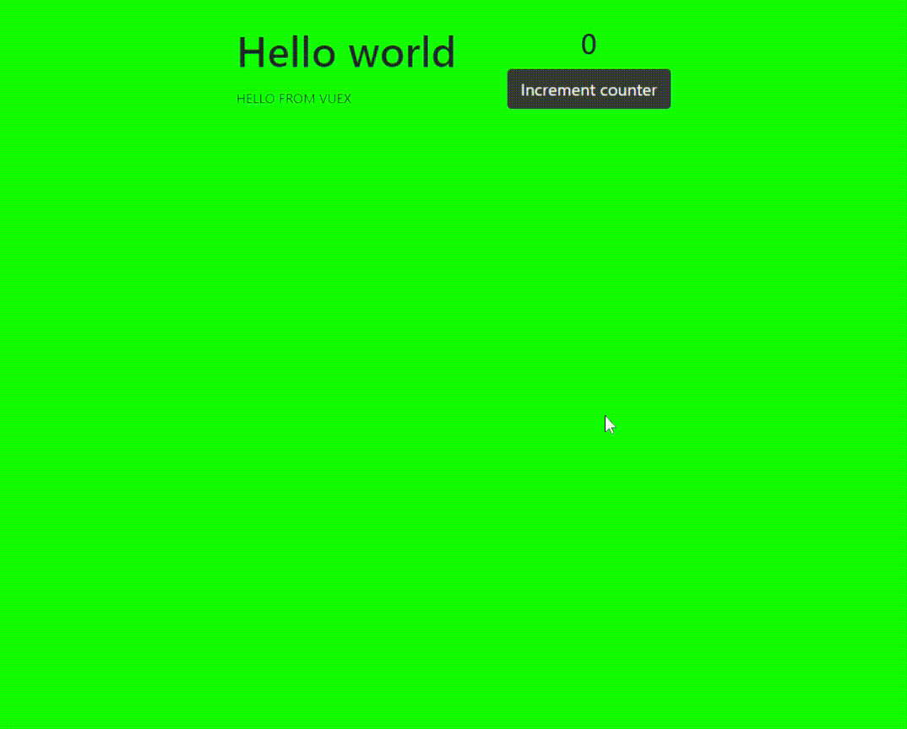

# What is "counter_using_vuex_2020"?
Simple page to count clicks at a button using vuex.

I'm learning Vue.js and Vuex, so <a href="https://www.youtube.com/watch?v=LW9yIR4GoVU">I followed this tutorial to do this counter</a>.